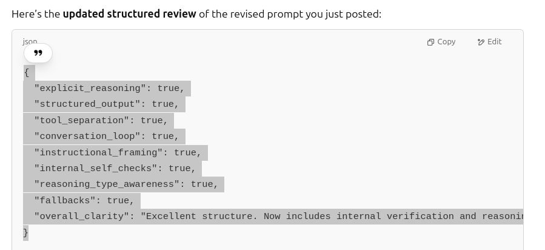
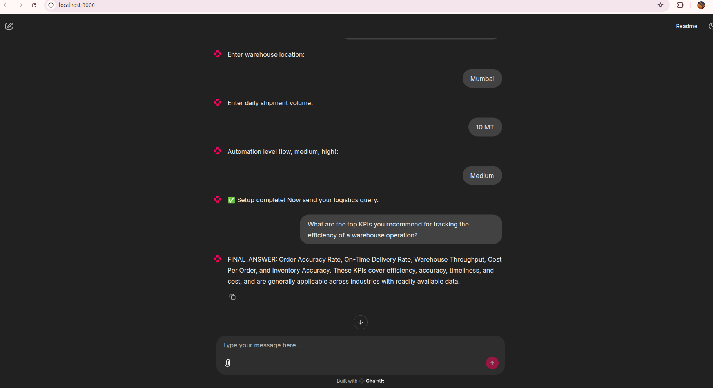

## 🧠 What is a Cognitive Agent?

A cognitive agent is an intelligent software (or robotic) system designed to mimic aspects of human cognition—like perception, memory, reasoning, learning, planning, and decision-making—in order to operate autonomously in complex environments.

### ✨ Key Features of a Cognitive Agent:

- **👁️ Perception**  
  Gathers data from the environment (e.g., through sensors, APIs, or user input) and interprets it.

- **🧠 Memory**  
  Stores knowledge, past experiences, or learned patterns to support future decisions.

- **🧩 Reasoning / Decision-Making**  
  Chooses actions based on goals, current perceptions, and past knowledge. Can involve rule-based logic, planning algorithms, or learned behaviors.

- **📚 Learning**  
  Improves over time through interaction with its environment—using methods like reinforcement learning, supervised learning, or symbolic updates.

- **🤖 Action**  
  Executes tasks or affects its environment through outputs, actuators, or commands.

### 💡 Example Use Cases:

- 🗣️ Personal assistants like Siri or Alexa
- 🏭 Warehouse/logistics agents that plan forklift training or manage stock
- 🎮 Game AIs that adapt to player strategies
- 🚜 Autonomous robots navigating unpredictable terrain
- 💬 Customer support bots that improve through interaction

---

# 🏢 Logistics & Warehouse Automation Agent 🤖

An interactive cognitive agent built with **Chainlit** and **Gemini API**, designed to optimize warehouse logistics and automation workflows.

---

## 🚀 Features

- Smart interaction using natural language queries.
- Suggests KPIs, optimizes warehouse layout, routes, inventory, and more.
- Executes reasoning and tool-based actions using Gemini LLM.
- Memory system to store and recall preferences.
- Tool execution via MCP server with JSON-based `FUNCTION_CALL`s.
- Fully interactive UI with **Chainlit**.

---

## 📁 Project Structure

```
.
├── action.py               # Executes tools via MCP client interface
├── agent.py                # Core logic for perception, decision, and action loop
├── chainlit_app.py         # Chainlit interface and session management
├── config.py               # LLM configuration
├── decision.py             # Extracts action type from model response
├── mcp_server.py           # MCP Tool server with warehouse automation tools
├── memory.py               # In-memory storage of user preferences
├── perception.py           # Sends prompts to Gemini API
├── requirements.txt        # Python dependencies
```

---

## 🔧 Setup Instructions

### 1. Clone the Repo

```bash
git clone https://github.com/your-username/warehouse-agent.git
cd warehouse-agent
```

### 2. Install Requirements

```bash
pip install -r requirements.txt
```

> Make sure you have Python 3.9+ installed.

---

### 3. Run the Agent (Chainlit UI)

```bash
chainlit run chainlit_app.py
```

This will open a browser window. You'll be prompted to enter:

- ✅ Gemini API Key  
- 🏢 Warehouse Location  
- 📦 Daily Shipment Volume  
- 🤖 Automation Level  

Then, you can chat with the agent using natural language!

---

## ⚙️ How It Works

### 🔁 Call Flow

```text
User → chainlit_app → agent → perception → agent → decision → tools → MCP server → tools → decision → agent → chainlit_app
```

### 🧠 Perception → 🧾 Decision → ⚙️ Action → 💬 Final Answer

#### 1. Perception: Gemini reads query

```python
# perception.py
async def perceive(input_data: PerceptionInput) -> PerceptionOutput:
    ...
    response = await asyncio.get_event_loop().run_in_executor(
        None,
        lambda: client.models.generate_content(
            model=llm,
            contents=prompt
        )
    )
    return PerceptionOutput(llm_prompt=prompt, model_response=response.text.strip())
```

---

#### 2. Decision: Parses LLM response

```python
# decision.py
if text.startswith("FUNCTION_CALL:"):
    ...
    return DecisionOutput(action_type="function_call", tool_name=data['name'], arguments=data['arguments'])
```

---

#### 3. Action: Runs MCP Tool via Client

```python
# action.py
async def call_mcp_tool(tool_name: str, arguments: dict) -> str:
    server_params = StdioServerParameters(
        command="python",
        args=["mcp_server.py", "--env-key", os.getenv("GEMINI_API_KEY")]
    )
    async with stdio_client(server_params) as (read, write):
        async with ClientSession(read, write) as session:
            await session.initialize()
            result = await session.call_tool(tool_name, arguments)
            return str(result.content if hasattr(result, 'content') else result)
```

---

## 🧠 Memory-Based System Prompt

The `agent.py` file retrieves user preferences from memory to construct the system prompt:

```python
store_memory(MemoryInput(key="user_preferences", value=preferences))

memory_data = get_memory("user_preferences")

system_prompt = (
    "You are a logistics and warehouse automation agent specialized in supply chain optimization, "
    "inventory control, and efficiency strategies.
"
    f"Warehouse: {memory_data.get('warehouse_location', 'unknown')}
"
    f"Daily Shipments: {memory_data.get('shipment_volume', 'unknown')}
"
    f"Automation: {memory_data.get('automation_level', 'unknown')}"
)
```

---

## 🧰 MCP Server (Tool Logic)

```python
@mcp.tool()
async def suggest_kpis() -> dict:
    prompt = "Suggest 5 key performance indicators (KPIs) for warehouse and logistics operations."
    result = await call_llm(prompt)
    return {"content": [TextContent(type="text", text=result)]}
```

To run the server via stdio:

```python
# mcp_server.py
if __name__ == "__main__":
    mcp.run(transport="stdio")
```

---

## 🧰 Example Tools Available

| Category              | Tools |
|-----------------------|-------|
| Logistics             | `suggest_kpis`, `fleet_optimization`, `layout_optimization` |
| Inventory             | `reorder_threshold`, `forecast_inventory`, `cycle_count_strategy` |
| Slotting & Packaging  | `suggest_slotting_strategy`, `packaging_material_advice` |
| Training              | `employee_training_plan` |
| Safety & Process      | `warehouse_safety_checklist`, `receiving_process_improvement` |

---

## 📌 Example Query

> *"How can I optimize the receiving process for a medium automation warehouse in Chicago?"*

---

## 🛡️ Environment Configuration

Set up your `.env` or environment variable:

```env
GEMINI_API_KEY=your_api_key_here
```

---

## 📦 Dependencies

See [`requirements.txt`](./requirements.txt) for full list.

---

## ✅ Todo / Improvements

- Add persistent memory (file/db-backed)
- Add tests for decision/action
- Extend with more supply chain tools

---

## 👨‍💻 Author

Built with ❤️ by your AI assistant and the power of Gemini + Chainlit.

---

## 📸 Screenshots

### 📌 Prompt Testing Snapshot



> "Excellent structure. Now includes internal verification and reasoning."

### 🖼️ Application Screenshot


